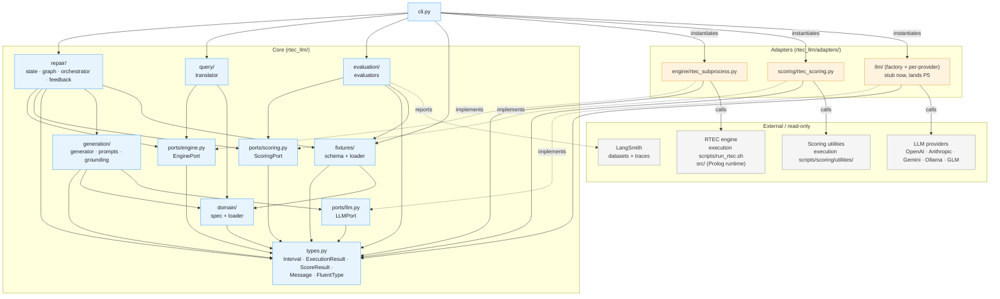

# ARCHITECTURE — `rtec_llm` AI layer

> Companion to [CLAUDE.md](../CLAUDE.md) (invariants) and
> [docs/ENGINE_NOTES.md](ENGINE_NOTES.md) (engine + scoring seams). This file
> documents the **target structure** of the `rtec_llm/` package and the
> dependency rules every adapter and core module must obey.
>
> Status: P1 — skeleton + port interfaces only. No business logic.

---

## 1. Oracle principle (single sentence)

**RTEC execution scored against ground-truth intervals via point-set timepoint
F1 is the *only* correctness signal in this codebase.** A clean compile,
valid grounding, valid vocabulary, or LLM self-confidence are NOT substitutes
(CLAUDE.md §3, §5 invariant 2). Every "this rule is fixed" claim — by an
adapter, by the orchestrator, by a test — must be backed by a score from
`ScoringPort`. This is why scoring is a port: the oracle is a *first-class
seam* in the architecture, not a debugging utility. Ground-truth interval
files in `fixtures/` MUST use RTEC's half-open `[s, e)` convention, or every
F1 is systematically wrong ([ENGINE_NOTES.md](ENGINE_NOTES.md) §7.8).

## 2. EDF / SDF research framing (single paragraph)

A *fluent* in RTEC is event-driven (**EDF**) when it is defined by
`initiatedAt` / `terminatedAt` rules over discrete events, and statically
determined (**SDF**) when it is defined by a single `holdsFor` rule whose
body composes other fluents via interval algebra
(`union_all` / `intersect_all` / `relative_complement_all` / `intDurGreater`).
The central thesis finding is **asymmetric**: EDFs converge quickly under the
repair loop (often single-shot), but SDFs requiring chained interval algebra
plateau below convergence — the loop can tell the LLM *which predicate is
missing* but struggles to teach it how to *restructure* interval algebra.
Therefore every `ScoreResult` carries a `FluentType` tag, and every evaluation
output preserves it (CLAUDE.md §5 invariant 7). Do not "fix" the gap by hiding
it; surfacing it honestly is the contribution.

---

## 3. Target tree

```
rtec_llm/
├── __init__.py                  # package docstring
├── py.typed                     # PEP 561 marker — downstream gets strict types
├── types.py                     # Interval, Window, FluentValuePair,
│                                # RecognisedFluent, ExecutionResult, EngineError,
│                                # ScoreResult, Message, Role,
│                                # Timestamp, FluentType
├── ports/                       # Protocol interfaces (the seams)
│   ├── __init__.py
│   ├── engine.py                # EnginePort
│   ├── scoring.py               # ScoringPort
│   └── llm.py                   # LLMPort (defined P1, adapter P5)
├── adapters/                    # Concrete implementations of ports
│   ├── __init__.py
│   ├── engine/
│   │   ├── __init__.py
│   │   └── rtec_subprocess.py   # runs run_rtec.sh's two steps directly:
│   │                            # compile.sh + swipl continuousQueries.prolog
│   ├── scoring/
│   │   ├── __init__.py
│   │   └── rtec_scoring.py      # wraps `execution scripts/scoring/utilities/`
│   └── llm/                     # provider factory (OpenAI / Claude /
│       └── __init__.py          # Gemini / Ollama / GLM) — stub, lands P5
├── domain/                      # Vocabulary loader (per-app YAML)
│   ├── __init__.py
│   ├── spec.py                  # typed Vocabulary / Predicate / BKPredicate
│   └── loader.py                # YAML → spec
├── fixtures/                    # Annotation-driven test cases (input contract)
│   ├── __init__.py
│   ├── schema.py                # typed FixtureSpec
│   └── loader.py                # JSON / YAML → FixtureSpec
├── generation/                  # Stateless rule generator
│   ├── __init__.py
│   ├── generator.py
│   ├── prompts.py               # system / user / repair prompt builders
│   └── grounding.py             # deterministic head-derived grounding
├── repair/                      # LangGraph StateGraph repair loop
│   ├── __init__.py
│   ├── state.py                 # RepairState (TypedDict)
│   ├── graph.py                 # StateGraph wiring
│   ├── orchestrator.py          # stateful diagnoser + router
│   └── feedback.py              # disagreement → typed repair instruction
├── query/                       # NL query → recognition-output answer
│   ├── __init__.py
│   └── translator.py
├── evaluation/                  # LangSmith evaluator functions + datasets
│   ├── __init__.py
│   └── evaluators.py
└── cli.py                       # thin entry point
```

**Wrappers, not rewrites.** `adapters/engine/rtec_subprocess.py` runs the two
steps `execution scripts/run_rtec.sh` performs internally — `auxiliary/compile.sh`
then `swipl -l continuousQueries.prolog -g continuousQueries(<app>, …)` — rather
than the driver script itself (see §8 / decision P2-1 for why: clean
compile-vs-runtime error separation, no `sleep 10` on a failed compile).
`adapters/scoring/rtec_scoring.py` imports
`execution scripts/scoring/utilities/{parser,compare,temporal_ops}.py`. The
existing engine and scoring code stay where they are — CLAUDE.md §5 invariant 1
(never modify the engine) extends to the scoring utilities, which are the
oracle's implementation.

---

## 4. Dependency diagram

Arrows point **inward** toward ports and types. Adapters depend on ports;
core business logic (generation / repair / query / evaluation) depends on
ports, types, and the domain spec; nothing depends on a concrete adapter
except the CLI (which wires them at the edge).



### Allowed and forbidden imports

| From | May import | Must NOT import |
|---|---|---|
| `types` | (nothing in the package) | anything else in `rtec_llm/` |
| `ports/*` | `types` | adapters, domain, fixtures, generation, repair, query, evaluation |
| `adapters/*` | `ports/*`, `types` | domain, fixtures, generation, repair, query, evaluation, other adapters |
| `domain/*` | `types` | ports, adapters, fixtures, generation, repair, query, evaluation |
| `fixtures/*` | `types`, `domain` | ports, adapters, generation, repair, query, evaluation |
| `generation/*` | `types`, `domain`, `ports/llm` | adapters, `ports/engine`, `ports/scoring`, fixtures, repair, query, evaluation |
| `repair/*` | `ports/*`, `types`, `domain`, `fixtures`, `generation` | adapters, query, evaluation |
| `query/*` | `ports/*`, `types`, `domain` | adapters, fixtures, generation, repair, evaluation |
| `evaluation/*` | `ports/*`, `types`, `fixtures` | adapters, generation, repair, query |
| `cli.py` | everything (it is the composition root) | — |

A violation of these directions is an architecture bug, not a style issue.
If `repair/` ever needs to know about `rtec_subprocess.py` directly, that is
the signal that the `EnginePort` interface is incomplete — extend the port,
do not bypass it.

---

## 5. Why these specific seams

**`LLMPort` is defined in P1; the concrete adapter lands in P5.** Multi-model
comparison (GPT-4o / Claude / Gemini / Ollama / GLM) is an explicit thesis
experiment, and the single-shot baseline needs the provider factory before
the repair loop is wired. Defining the port now lets `generation/` import a
stable interface from the first commit; only `cli.py` (the composition root)
sees a concrete provider. The generator imports `ports/llm` only — never
`ports/engine` or `ports/scoring`, because the generator neither executes
nor scores.

**Fixtures are a package, not a directory of JSON files.** The behavioural
annotation is the input contract (CLAUDE.md §6), so the schema needs typing,
validation, and a stable import path. Living parallel to `domain/` keeps
ground-truth alongside vocabulary — both are read-only declarative inputs to
the loop — and the import rules (fixtures may only see `types` + `domain`)
prevent ground-truth from accidentally leaking into the generator.

**Engine and scoring are separate ports** even though both wrap things under
`execution scripts/`. They have independent failure modes
(engine: compile / runtime errors; scoring: ground-truth mismatch, missing
FVPs), independent input / output shapes, and independent test strategies
(engine: subprocess + Prolog; scoring: pure-Python interval arithmetic).
Bundling them would hide the oracle inside the executor — exactly the design
mistake CLAUDE.md §3 warns against.

**`fluent_type` lives on `ScoreResult`, not on `EnginePort.run`.** The engine
has no notion of EDF vs SDF; the tag is a thesis-level label attached during
evaluation. Putting it on the score keeps the engine adapter ignorant of
research framing and prevents leakage.

**`ExecutionResult.errors` is a list, not an exception.** Engine compile
errors are *data* the repair orchestrator reacts to — they are the highest-
information signal for the next iteration. Raising would force every caller
to wrap in try/except and would lose structured detail.

---

## 6. Things this architecture does NOT permit

These are not stylistic preferences — they are explicit rejections from
CLAUDE.md §4 / §5. Listed here so a future contributor sees them in context:

1. **No replacing the StateGraph** with LangChain chains, a free-form ReAct
   loop, or a single mega-agent. Deterministic conditional routing over
   typed shared state is required for thesis reproducibility.
2. **No LLM authoring grounding declarations.** Grounding is derived from the
   rule head by `generation/grounding.py`. Period.
3. **No `compile clean → call it fixed`.** A clean compile is not a
   correctness signal. Only F1 from `ScoringPort` is.
4. **No monotonic-F1 assumption.** Iterations can regress; the repair loop
   keeps a strict best-so-far snapshot and only commits when F1 *strictly*
   improves.
5. **No engine modifications**, including the scoring utilities. We wrap.
6. **No inventing domain vocabulary.** Every emitted predicate must exist in
   the loaded `Vocabulary`; missing vocabulary fails fast in `generation/`,
   not silently at execution time.
7. **No reintroducing expert-written reference rules** as the input contract
   (CLAUDE.md §6). The behavioural annotation is the contract; that is the
   abandoned "Approach 1."
8. **No mutation of canonical example apps.** `run_rtec.sh` compiles
   `rules.prolog` → `compiled_rules.prolog` *in place*, so testing a generated
   rule must never touch `examples/<app>/`. Each `EnginePort.run` writes **only
   the candidate rules** to a fresh temp directory; because `compile.sh` derives
   its output path from the rules path, `compiled_rules.prolog` lands in that
   temp dir too, and the recognised-intervals file is directed there via an
   explicit `results_directory`. The `auxiliary/` static files (and everything
   `loadStaticData.prolog` transitively consults) and the event stream are **not
   copied** — they are consulted **read-only in place** from `examples/<app>/`
   by their original paths (consulting writes nothing; their `:- ['./…']`
   directives resolve relative to their own directory). Net effect: the
   committed `examples/<app>/` tree — including its `compiled_rules.prolog` and
   `results/` — is byte-for-byte untouched, enforced by
   `test_run_leaves_inplace_tree_untouched`. This also resolves the `results/`
   filename-collision noted in [ENGINE_NOTES.md](ENGINE_NOTES.md) §7.6 — each
   run writes into its own temp dir.

---

## 7. Open questions and forward flags

(Not blockers for P1 sign-off; logged so they are not lost.)

**Open questions for P2:**

- **Where does `Vocabulary` live in `RepairState`?** Embedded per-iteration
  (heavy, redundant) or referenced by handle (cleaner; needs a resolver).
- **Disagreement-timestamp sampling strategy.** Full list (memory-heavy for
  long maritime intervals) or strided sample (cheaper; risks missing rare
  drift)? Likely strided with adaptive density near disagreement clusters.

**Flagged for later phases (do not act now):**

- **P3 — scoring adapter against a non-package path.** The scoring utilities
  live at `execution scripts/scoring/utilities/` — a directory with a space
  in the name, not importable as a regular Python package. The P3
  `rtec_scoring.py` adapter will load them via `sys.path` insertion +
  `importlib`, and the boundary import will need a single
  `# type: ignore[import-untyped]` because the wrapped modules have no type
  annotations. Keep the `type: ignore` narrow and at the import line only.
- **P3 — parser ownership (decided P2-2).** The engine adapter owns parsing of
  RTEC's *predicted* output into typed `RecognisedFluent`/`ExecutionResult`
  intervals (stdlib regex, already done). The scoring adapter therefore
  **consumes those typed intervals directly and parses only the ground-truth
  file** — reusing `scoring/utilities/parser.parse_file` for GT and
  `compare.compare_ce`/`get_micro`/`get_macro` for F1. There is exactly one
  parse path for predictions (the engine adapter); the scoring layer must not
  re-parse RTEC stdout/result files. This keeps the documented dependency
  boundary (engine = stdlib+subprocess; scoring = wraps the F1 utilities) and
  avoids double-parsing the prediction side.
- **P8 — `query/` is recognise-then-filter, not point queries.**
  `run_rtec.sh` does window recognition to a file; it does not expose
  ad-hoc `holdsAt(F=V, T)` point queries. The realistic shape of `query/`
  is therefore "run RTEC over the relevant window via `EnginePort`, then
  filter the recognised intervals in Python" — which `EnginePort` already
  supports as-is. No new port needed; revisit only if a query pattern truly
  cannot be expressed by filtering a `RecognisedFluent` set.

---

## 8. Changelog / decision record

No separate changelog file; phase-level decisions that diverge from or sharpen
this document are recorded here.

**P2 — engine adapter (`adapters/engine/rtec_subprocess.py`), 2026-05-31:**

- **P2-1 — run the two steps directly, not `run_rtec.sh`.** The adapter invokes
  `auxiliary/compile.sh` then `swipl … continuousQueries.prolog` itself instead
  of shelling out to `run_rtec.sh`. Rationale: (a) the exit codes of the two
  steps separate `compile_error` from `runtime_error` cleanly; (b) `run_rtec.sh`
  does `sleep 10` on a failed compile, which would tax the repair loop. Same
  engine, same recognition output (smoke-verified identical on toy + maritime);
  execution params are passed explicitly from `Window` (+ fixed `input_mode=csv`,
  `output_mode=file`) rather than read from `defaults.toml`, with `clock_tick`/
  `stream_rate` left to `handleApplication.prolog` app defaults. Supersedes the
  "wrap the bash driver" recommendation in [ENGINE_NOTES.md](ENGINE_NOTES.md)
  §3.1 / §7.1.
- **P2-2 — parser ownership.** Predicted-interval parsing lives in the engine
  adapter (stdlib); the scoring adapter parses ground truth only. See the P3
  forward flag in §7.
- **Staging clarified.** Only candidate rules are staged to temp; static data
  and the event stream are consulted read-only in place. §6 #8 updated to match;
  enforced by `tests/test_engine_smoke.py::test_run_leaves_inplace_tree_untouched`.
